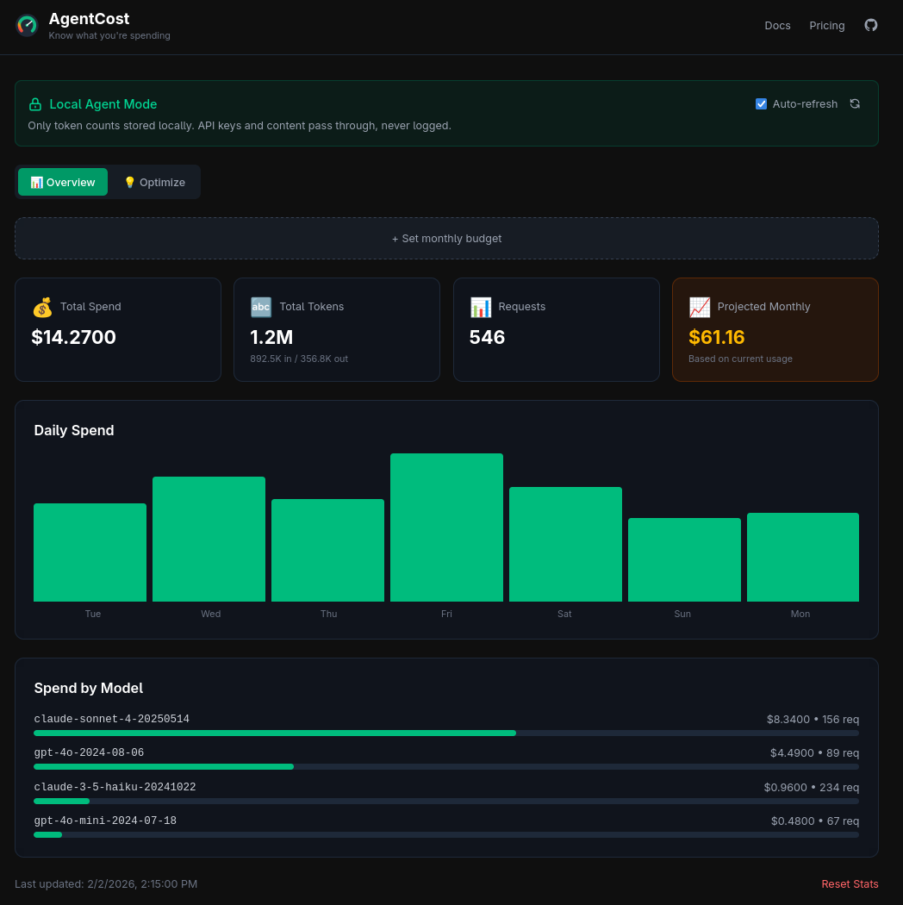

<p align="center">
  
</p>

<h1 align="center">AgentCost</h1>

<p align="center"><strong>Know what you're spending on AI.</strong></p>

<p align="center">
  
</p>

Privacy-first AI cost tracking. All data stays on your machine.

**Requirements:** Node.js 18+

## Quick Start

```bash
# Clone and install
git clone https://github.com/n1byn1kt/agentcost
cd agentcost
npm install
npm install -g .

# Start the agent (runs on port 8787)
agentcost agent
```

### Option A: Use the CLI wrapper
```bash
# Wrap any command - automatically routes through proxy
agentcost run python my_script.py
agentcost run aider --model claude-3-5-sonnet

# View stats
agentcost stats
```

### Option B: Configure your environment
```bash
# Add to your shell profile (~/.bashrc, ~/.zshrc, etc.)
export OPENAI_BASE_URL=http://localhost:8787/openai
export ANTHROPIC_BASE_URL=http://localhost:8787/anthropic

# Your existing scripts/tools will now route through AgentCost
```

**Note:** Your actual API keys (`OPENAI_API_KEY`, `ANTHROPIC_API_KEY`) stay in your environment as usual — AgentCost just proxies the requests.

## How It Works

1. **Local Agent** runs on your machine (port 8787)
2. **Proxy routes** your API calls through it
3. **Usage tracked** locally - only token counts, never content
4. **Dashboard** shows spend, trends, and optimization tips

```
Your App → AgentCost Agent → Anthropic/OpenAI API
              ↓
        Track tokens & cost
        (content NOT stored)
```

## Philosophy

- **Privacy by design** — Keys & content never leave your machine
- **Signal-level privacy** — Can't comply with data requests because data doesn't exist
- **Intelligence over dashboards** — Don't just show spend, show savings

## Features

### Dashboard
Run `npm run dev` to start the dashboard at `http://localhost:5173`

- ✅ Multi-provider overview (OpenAI + Anthropic)
- ✅ Daily spend visualization
- ✅ Model breakdown
- ✅ Projected monthly costs
- ✅ **Optimization tab** — See where you can save

### CLI
- ✅ Wrap any command: `agentcost run <cmd>`
- ✅ Auto-starts agent if needed
- ✅ Session cost summary after each run
- ✅ Stats command: `agentcost stats`

### Budget API (v1.5)
Let your AI agents self-regulate their spend:

```bash
# Set budget limits
curl -X POST http://localhost:8787/api/budget \
  -H "Content-Type: application/json" \
  -d '{"dailyLimit": 10, "monthlyLimit": 100}'

# Check current status
curl http://localhost:8787/api/budget/status

# Pre-flight check before expensive operations
curl "http://localhost:8787/api/budget/preflight?model=claude-sonnet-4&estimatedTokens=10000"
```

### Privacy Guarantees
```
✓ Token counts (stored)
✓ Model names (stored)
✓ Timestamps (stored)
✗ Prompts (NEVER stored)
✗ Responses (NEVER stored)
✗ API keys (NEVER stored)
```

## Development

```bash
npm install
npm run dev      # Dashboard at localhost:5173
npm run agent    # Agent at localhost:8787 (separate terminal)
```

## Roadmap

- [x] Local agent with proxy
- [x] React dashboard
- [x] Optimization recommendations
- [x] Budget API with pre-flight checks
- [ ] Publish to npm
- [ ] Docker image
- [ ] More providers (Google, Mistral)

## Why AgentCost?

- **OpenAI/Anthropic dashboards**: Show your spend, but no cross-provider view
- **Helicone/Langfuse**: See your data (privacy concern)
- **AgentCost**: Your data never leaves your machine

---

Built with 🦞 by [n1byn1kt](https://github.com/n1byn1kt)
